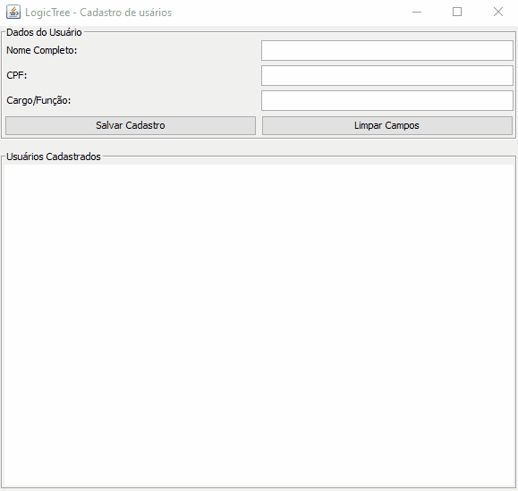

# LogicTree - Sistema de Gestão de Projetos

Este projeto é uma solução computacional desenvolvida em **Java** para a gestão de usuários e projetos. 
O software foi criado como parte das atividades práticas do 1º semestre de 2026.

## 🎓 Informações Acadêmicas
- **Instituição:** Centro Universitário Una
- **Curso:** Tecnologia em Inteligência Artificial
- **Período:** 1º Semestre / 2026
- **Estudante:** Luciano Augusto da Silva - Matricula: 2026107130

## 🚀 Sobre o Projeto
O **LogicTree** permite o cadastro de colaboradores e a organização de projetos, vinculando gerentes a tarefas específicas. 
O foco principal foi aplicar os fundamentos da Programação Orientada a Objetos (POO) e controle de fluxo.

## 🛠️ Tecnologias e Conceitos
- **Linguagem:** Java
- **IDE:** IntelliJ IDEA
- **Interface:** Swing (Interface Gráfica)
- **Conceitos Aplicados:** 
  - Estruturas de repetição (`for`, `while`)
  - Estruturas de decisão (`if/else`, `switch/case`)
  - Listas dinâmicas (`ArrayList`)
  - Orientação a Objetos (Classes e Objetos)

## 📋 Como Executar
1. Certifique-se de ter o Java (JDK) instalado.
2. Baixe a pasta `src` deste repositório.
3. Abra no IntelliJ IDEA.
4. Execute o arquivo `InterfaceSistema.java` para abrir a interface visual.

---
*Projeto desenvolvido para fins de aprendizado acadêmico.*
